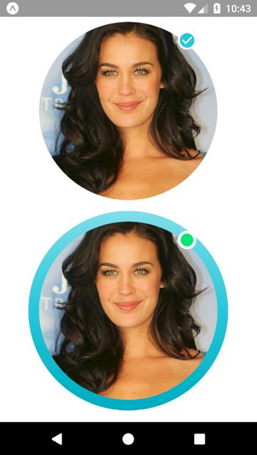

# React Native: react-native-photo-status

[](https://www.npmjs.com/package/react-native-photo-status)

[](https://github.com/gaetanozappi/react-native-photo-status)
[](https://www.npmjs.com/package/react-native-photo-status)

[](https://github.com/gaetanozappi/react-native-photo-status/issues)
[](https://github.com/gaetanozappi/react-native-photo-status/issues?q=is%3Aissue+is%3Aclosed)
[](http://github.com/gaetanozappi/react-native-photo-status/issues)
[]()



-   [Usage](#usage)
-   [License](#license)

## 📖 Getting started

`$ npm install react-native-photo-status --save`

## Usage

```javascript
import React, { Component } from 'react';
import { View } from 'react-native';
import PhotoStatus from 'react-native-photo-status';

export default class App extends Component {
  render() {
    return (
      <View style={{ flex: 1, alignItems: 'center', justifyContent: 'center' }}>
        <PhotoStatus
          colors={['#FFFFFF', '#FFFFFF']}
          dim={300}
          image={{
            uri: 'http://www.prettydesigns.com/wp-content/uploads/2013/12/Megan-Gale-Long-Hairstyle-Layered-Hair.jpg',
          }}
          isStatus={true}
          isIcon={true}
          icon={'md-checkmark-circle'}//Use the Ionicons icons.
          iconSize={25}
          iconColor={'#26C6DA'}
        />
        <PhotoStatus
          colors={['#80DEEA', '#26C6DA', '#00ACC1']}
          dim={300}
          image={{
            uri: 'http://www.prettydesigns.com/wp-content/uploads/2013/12/Megan-Gale-Long-Hairstyle-Layered-Hair.jpg',
          }}
          isStatus={true}
          isIcon={false}
          colorStatus={'#00E676'}
        />
      </View>
    );
  }
}

```

## 💡 Props

| Prop              | Type       | Default | Note                                                                                                       |
| ----------------- | ---------- | ------- | ---------------------------------------------------------------------------------------------------------- |
| `color`      | `array`   |  | We need to pass an array of the colors, as in the example.
| `dim`       | `number`   |    | Circle size.
| `image`      | `object`   |  | We need to pass an image, as in the example.
| `isStatus`      | `bool`   |  | Indicates whether to have the status icon.
| `isIcon`      | `bool`   |  | Indicates whether to have the status icon.
| `icon`      | `Ionicons`   |  | Indicates what kind of icon to use.
| `iconSize`      | `number`   |  | Icon size.
| `iconColor`      | `string`   |  | Icon color.
| `colorStatus`      | `string`   |  | Indicates the background color of the status.

## License
This library is provided under the Apache License.
